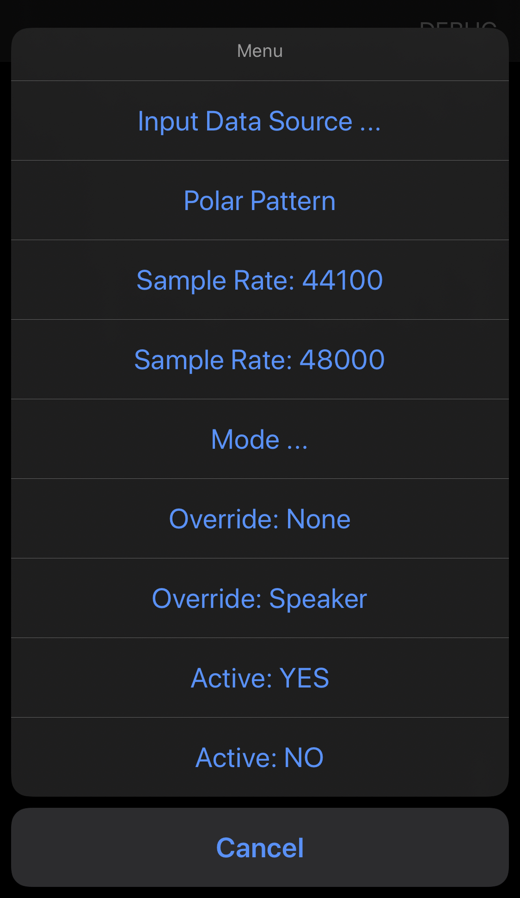
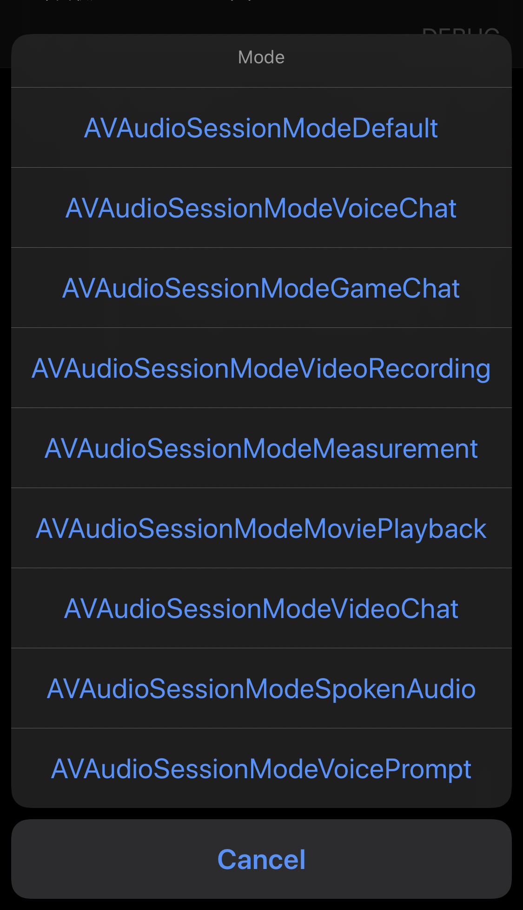

## AVPlayer volume is lower after using VPIO (VoiceProcessingIO) AudioUnit

This demo is only used to reproduce apple's audio issue about VPIO and AVPlayer.

### Description

 We have two business in one app: chat room and video recording:
 - Chat room use VoiceProcessingIO (aka. VPIO) Audio Unit to process microphone data in order to cancel the echo function (aka. AEC). 
 - Video recording use AVPlayer to play BGM while camera is capturing. 
 
 These two business are both running in PlayAndRecord AudioSessionCategory and must run in PlayAndRecord. When entering chat room and then leaving chat room, then enter the video recording business, the BGM volume is very low (the sound is from speaker).

We know the initializing of VPIO can cause mode to VoiceChatMode and the sound output to the headpiece, so after leaving chat room, we set AudioSessionCategory to playback and defalt mode, then entering video recording we set to PlayAndRecord.

We simplificate the issue:
In PlayAndRecord category, the AVPlayer instance created after the initializing VPIO AudioUnit (even if VPIO was disposed), the volume is lower then the one created before initializing VPIO.

### Configuration

- iOS 14 and iOS 15 can both reproduce the issue.

To reproduce the isssue, we upload a demo to github: 
https://github.com/drummerchin/AudioIssue.git

 
 
 

This demo have some buttons:

- *EnterChatRoom* button, it represents entering the chat room, creating and using VPIO.
- *LeaveChatRoom* button, it represents leaving the chat room and destroying the VPIO.
- *NewAVPlayer* button, it create an AVPlayer instance.
- *Play* button, it play the audio file.
- *Pause* button, it pause the audio file.
- *DestroyAVPlayer* button, destroy the AVPlayer instance.
- *DEBUG* button, you can use the menu to set audio session for debug.

## Steps to Reproduce

0. Click NewAVPlayer, Play, Pause, DestroyAVPlayer. (Repeat this step many times and it is normal).
1. Click EnterChatRoom
2. Click LeaveChatRoom
3. Click NewAVPlayer and then click Play, you may noticed the volume is lower then step 0. If volume still normal, click DestroyAVPlayer and repeat this step. 
